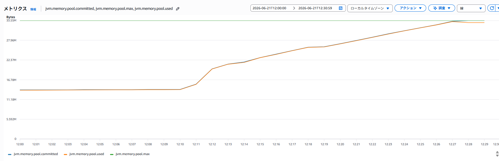
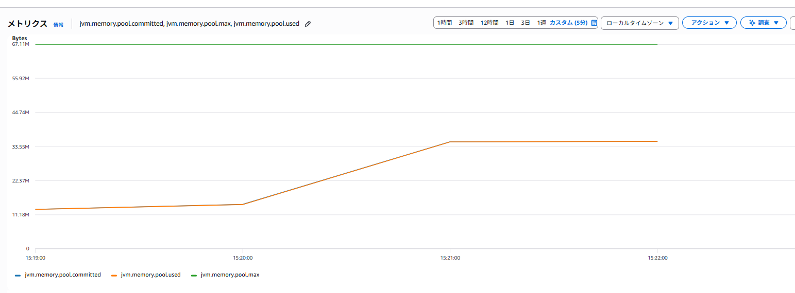
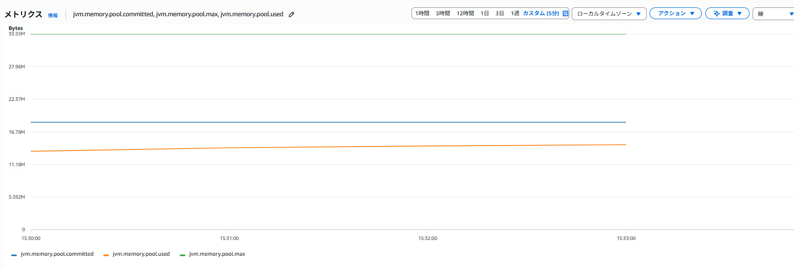

## 検証の目的

JVMのCode Cacheを意図的に満杯にし、JITコンパイル停止前にコンパイルされた処理と、停止後に
初めて実行する処理の応答時間を比較する。また、Code Cacheの使用量と上限をCloudWatchで
監視できることを確認する。

事前の仮説は次のとおりである。

- Code Cacheが満杯になるとJITコンパイラが停止する。
- 満杯になる前にコンパイルされたHot処理は、満杯後もコンパイル済みコードを利用できる。
- 満杯後に初めて呼ぶCold処理はJITコンパイルされず、Hot処理より遅くなる。
- Code Cacheの上限を増やすと、同じ負荷で満杯になるまでの余裕が増える。

Code Cache、JIT、Tiered Compilationの仕組みは、別ページの
[JVM Code Cacheの仕組み](code_cache_overview.qmd)を参照する。

## 検証環境

| 項目 | 内容 |
|---|---|
| 検証日 | 2026-06-21 |
| AWSリージョン / AZ | ap-northeast-1 / ap-northeast-1c |
| EC2 | t3.micro、x86_64、2 vCPU、メモリ約1GiB |
| OS | Ubuntu 26.04 LTS |
| CPU | Intel Xeon Platinum 8175M 2.50GHz |
| Javaディストリビューション | Ubuntu OpenJDK 64-Bit Server VM |
| Javaバージョン | OpenJDK 21.0.11 |
| アプリケーション | Spring Boot `code-cache-demo` 0.0.1-SNAPSHOT |
| Git commit | `93dcc73a64da1d3280c9a66f5d866517bd34f200` |
| CloudWatch Agent | 1.300069.0b1529 |
| 負荷生成方法 | 検証profile限定Generator APIで異なるクラスを1,000個ずつ生成 |
| 負荷量 | 1クラス当たり10,000回実行、32MB試験では合計16,000クラス |

環境情報は次のコマンドで確認した。

```bash
cat /etc/os-release
lscpu
free -h
java -version
git rev-parse HEAD
```

## 検証アプリケーション

検証用APIはSpring profile `code-cache-test`を有効にした場合だけ利用できる。

| API | 役割 |
|---|---|
| `POST /code-cache/generator/generate` | 異なるクラスとメソッドを生成し、JITコンパイルを促す |
| `GET /code-cache/probe/hot` | 満杯前にwarm-upする固定メソッド |
| `GET /code-cache/probe/cold` | 満杯後まで呼ばない、Hotと同じ計算内容の別メソッド |
| `GET /code-cache/generator/status` | JVM内で生成したクラス数を確認する |

Generator、Hot、Coldを分離した理由は、Code Cacheを圧迫する処理と、遅延を測定する処理を
同じメソッドにしないためである。HotとColdは同じ入力と計算式を使い、Java上では異なるメソッドとして
実装している。

## 検証条件

### 32MB Code Cache

```text
-XX:ReservedCodeCacheSize=32m
-XX:-UseCodeCacheFlushing
-Xlog:codecache*=warning
-Dcom.sun.management.jmxremote
-Dcom.sun.management.jmxremote.host=127.0.0.1
-Dcom.sun.management.jmxremote.port=9010
-Dcom.sun.management.jmxremote.rmi.port=9010
-Dcom.sun.management.jmxremote.local.only=true
-Dcom.sun.management.jmxremote.authenticate=false
-Dcom.sun.management.jmxremote.ssl=false
-Djava.rmi.server.hostname=127.0.0.1
--spring.profiles.active=code-cache-test
```

主要なオプションの意味は次のとおりである。

| オプション | 目的 |
|---|---|
| `ReservedCodeCacheSize=32m` | Code Cacheの最大容量を32MBに固定する |
| `-UseCodeCacheFlushing` | Sweeperによる通常回復を無効にし、満杯状態を維持する検証専用条件 |
| `-Xlog:codecache*=warning` | 満杯とコンパイラ停止のwarningをログへ出す |
| JMX 9010 | CloudWatch AgentがJVMメトリクスを取得する。localhost限定で外部公開しない |
| `code-cache-test` | GeneratorとHot/Cold APIを有効にする |

`-Xcomp`はすべてのメソッドを強制コンパイルし、HotとColdの差を確認する試験条件を変えるため使用しない。
また、`-XX:-UseCodeCacheFlushing`は通常運用の推奨値ではなく、満杯状態を確実に維持するためだけに使う。

## CloudWatch監視条件

CloudWatch AgentはlocalhostのJMX 9010から、次の3メトリクスを60秒間隔で収集した。

| グラフの色 | JMXメトリクス | 確認する項目 |
|---|---|---|
| 青 | `jvm.memory.pool.committed` | committed（JVMが利用可能として確保済みのCode Cache容量） |
| 緑 | `jvm.memory.pool.max` | max（Code Cacheの最大容量） |
| オレンジ | `jvm.memory.pool.used` | used（現在使用中のCode Cache容量） |

JVMログはCloudWatch Logsの`/code-cache-demo/application`へ送信した。JMX標準メトリクスでは
`full_count`やJITコンパイラの停止状態を取得できないため、CloudWatchの`used`、`max`、`committed`、
JVM warningログ、
`jcmd`を組み合わせて判定した。

## 検証方法

最初にHotだけを100回warm-upした。Coldは満杯になるまで一度も呼ばなかった。

```bash
for i in $(seq 1 100); do
  curl -fsS \
    'http://localhost:8080/code-cache/probe/hot?count=100000' >/dev/null
done
```

Generatorで1,000クラスずつ追加し、各batch後に`Compiler.codecache`を確認した。CloudWatchの
60秒samplingで段階的な値を残すため、batch間を65秒空けた。

```bash
for i in $(seq 1 20); do
  curl -fsS -X POST \
    'http://localhost:8080/code-cache/generator/generate?classes=1000&warmupIterations=10000'

  jcmd "$PID" Compiler.codecache
  sleep 65
done
```

`full_count > 0`または`Compilation: disabled`を検出した時点でGeneratorを停止し、HotとColdを
同じ`count=1,000,000`で1回ずつ測定した。

```bash
curl -fsS \
  'http://localhost:8080/code-cache/probe/hot?count=1000000'

curl -fsS \
  'http://localhost:8080/code-cache/probe/cold?count=1000000'
```

測定後、HotとColdそれぞれのコンパイルLevelを確認した。

```bash
# Tiered Compilationの有効状態と到達可能な最大Levelを確認する
jcmd "$PID" VM.flags -all \
  | grep -E 'TieredCompilation|TieredStopAtLevel'

# HotとColdのコンパイル済みコードを個別に確認する
jcmd "$PID" Compiler.codelist \
  | grep 'CodeCacheProbeService.hot'

jcmd "$PID" Compiler.codelist \
  | grep 'CodeCacheProbeService.cold' || true

# コンパイル待ちが残っていないか確認する
jcmd "$PID" Compiler.queue
```

`Compiler.codelist`では先頭がcompile ID、その次がLevelである。Level 4の行があればC2コンパイル済み、
対象メソッドの行がなければCode Cacheにコンパイル済みコードがない。今回のように
`Compilation: disabled`でColdの行がない場合、ColdはLevel 0のインタープリタで実行される。

## 検証結果

### Code Cache満杯

32MB条件ではGeneratorの16回目、合計16,000クラスを生成した時点で初めて満杯を検出した。

::: {.result-evidence}
**Generator状態の確認**

```console
# 実行コマンド
$ curl -fsS http://localhost:8080/code-cache/generator/status

# 実行結果
{"totalGenerated":16000,"sink":31744}
```
:::

満杯後の`jcmd`出力は次のとおりである。

::: {.result-evidence}
**Code Cache状態の確認**

```console
# 実行コマンド
$ jcmd "$PID" Compiler.codecache

# 実行結果
9652:
CodeCache: size=32768Kb used=32204Kb max_used=32767Kb free=563Kb
 bounds [0x0000744d70e00000, 0x0000744d72e00000, 0x0000744d72e00000]
total_blobs=23969, nmethods=23336, adapters=540, full_count=1
Compilation: disabled (not enough contiguous free space left), stopped_count=0, restarted_count=0
```
:::

`Compiler.codecache`の各項目は次のように読む。

| 項目 | 意味 | 今回の読み方 |
|---|---|---|
| PID行 | 診断対象のJava process ID | `9652`が検証アプリケーションのPIDである |
| `size` | `ReservedCodeCacheSize`で予約したCode Cacheの最大容量 | `32768Kb`なので32MB設定が反映されている |
| `used` | コマンド実行時点で使用中の容量 | 現在は`32204Kb`を使用している |
| `max_used` | JVM起動後に記録した使用量の最大値 | 過去に`32767Kb`まで使用した。現在の`used`が減っても履歴として残る |
| `free` | 現在の空き容量。概ね`size - used` | `563Kb`空いているが、必要な連続領域を確保できるとは限らない |
| `bounds` | Code Cacheの開始address、現在commit済み領域の終端、予約領域の終端 | 容量判定では通常addressそのものを比較する必要はない |
| `total_blobs` | Code Cache内にあるcompiled method、adapter、JVM内部stubなどの総数 | 今回は`23969`個存在する |
| `nmethods` | JITコンパイルされたJavaメソッドのネイティブコード数 | 今回は`23336`個。Javaのメソッド数や生成クラス数と完全には一致しない |
| `adapters` | インタープリタとコンパイル済みコードなど、異なる呼び出し規約を接続するコード数 | 今回は`540`個存在する |
| `full_count` | JVM起動後にCode Cache満杯を検出した累積回数 | `1`なので、現在空きがあっても過去に1回満杯になった証拠になる |
| `Compilation` | JITコンパイラの現在状態 | `disabled`なので新しいJITコンパイルを実行できない |
| `stopped_count` | JVMが記録したコンパイラ停止回数 | 今回は`0`。JDKや停止経路で値が異なるため、この値だけで満杯を判定しない |
| `restarted_count` | Code Cache回復後にコンパイラを再開した回数 | 今回は`0`。flushingを無効にしているため再開していない |

現在使用率と過去最大使用率は、必要に応じて次のように計算する。

```text
現在使用率     = used / size * 100
過去最大使用率 = max_used / size * 100
```

`free`が0でなくても、コンパイル対象を配置できる十分な大きさの**連続した空き領域**がなければ
`Compilation: disabled (not enough contiguous free space left)`になる。したがって、満杯判定では
`used`だけでなく、`max_used`、`full_count`、`Compilation`、JVM warningを組み合わせて確認する。

瞬間最大使用量は32,767KBで、32,768KBに対して約100%だった。観測時点では563KBが空いていたが、
`full_count=1`は過去に満杯へ到達した累積証跡であり、`Compilation: disabled`は新しいコンパイルに
必要な連続領域を確保できない状態を示す。

今回のJDKではスナップショット時点の`stopped_count`は0だった。この値だけでは判定せず、
`full_count`、`Compilation: disabled`、次のJVM warningを根拠にした。

::: {.result-evidence}
**JVM warningの確認**

```console
# 実行コマンド
$ grep -E 'CodeCache is full|Try increasing|CodeCache: size=' \
    /home/ubuntu/code-cache-demo.log

# 実行結果
[warning][codecache] CodeCache is full. Compiler has been disabled.
[warning][codecache] Try increasing the code cache size using -XX:ReservedCodeCacheSize=
CodeCache: size=32768Kb used=32767Kb max_used=32767Kb free=0Kb
```
:::

### Hot/Cold応答時間

測定コマンドと実際のJSON responseは次のとおりである。

::: {.result-evidence}
**Hot/Cold応答時間の測定**

```console
# Hotの実行コマンド
$ curl -fsS \
    'http://localhost:8080/code-cache/probe/hot?count=1000000'

# Hotの実行結果
{"probe":"hot","count":1000000,"result":1065335877410878341,"elapsedNanos":2124399}

# Coldの実行コマンド
$ curl -fsS \
    'http://localhost:8080/code-cache/probe/cold?count=1000000'

# Coldの実行結果
{"probe":"cold","count":1000000,"result":1065335877410878341,"elapsedNanos":24455935}
```
:::

Hot/Cold APIのresponse項目は次のとおりである。

| 項目 | 意味 | 比較時の見方 |
|---|---|---|
| `probe` | 実行したメソッドの種類 | `hot`は事前コンパイル済み、`cold`は満杯後に初めて呼ぶメソッド |
| `count` | HotまたはColdメソッド内で計算を繰り返した回数 | HotとColdで同じ値に揃える。今回は各1,000,000回 |
| `result` | 計算結果。処理が実際に実行され、同じ計算になっていることを確認する値 | HotとColdで一致することを確認する。性能値ではない |
| `elapsedNanos` | Spring Controller内でHotまたはColdメソッドを呼び出す直前から、戻る直後までを`System.nanoTime()`で測った時間 | 小さいほど高速。HTTP通信時間は含まず、`1,000,000ns = 1ms`で換算する |

`elapsedNanos`はサーバー内部の1回の測定値であり、ネットワークを含むAPI全体の応答時間ではない。
HotとColdは同じ`count`と`result`で比較し、必要に応じて複数回またはJVMを再起動して再測定する。

| Probe | count | result | elapsedNanos | ミリ秒換算 |
|---|---:|---:|---:|---:|
| Hot | 1,000,000 | 1065335877410878341 | 2,124,399 | 約2.12ms |
| Cold | 1,000,000 | 1065335877410878341 | 24,455,935 | 約24.46ms |

HotとColdの`result`は一致し、同じ計算結果であることを確認した。Coldの処理時間はHotの約11.5倍だった。

::: {.result-evidence}
**Hot/Cold処理時間比の計算**

```console
# 実行コマンド
$ awk 'BEGIN { print 24455935 / 2124399 }'

# 実行結果
11.5119
```
:::

`Compiler.codelist`には`CodeCacheProbeService.hot`のLevel 3とLevel 4コンパイル済みコードが存在し、
Coldは存在しなかった。したがって、Hotは満杯前のコンパイル済みコードを利用し、ColdはJIT停止後に
インタープリタで実行されたと判断した。

::: {.result-evidence}
**Hot/ColdのコンパイルLevel確認**

```console
# Tiered Compilation設定の確認コマンド
$ jcmd "$PID" VM.flags -all \
    | grep -E 'TieredCompilation|TieredStopAtLevel'

# 実行結果
bool TieredCompilation = true {pd product} {default}
intx TieredStopAtLevel = 4 {product} {default}

# Hotの確認コマンド
$ jcmd "$PID" Compiler.codelist \
    | grep 'CodeCacheProbeService.hot'

# Hotの実行結果
5933 3 2 com.example.codecache.codecache.CodeCacheProbeService.hot(I)J [...]
5934 4 0 com.example.codecache.codecache.CodeCacheProbeService.hot(I)J [...]

# Coldの確認コマンド
$ jcmd "$PID" Compiler.codelist \
    | grep 'CodeCacheProbeService.cold'

# Coldの実行結果: 出力なし

# compile queueの確認コマンド
$ jcmd "$PID" Compiler.queue

# 実行結果
9652:
Current compiles:

C1 compile queue:
Empty

C2 compile queue:
Empty
```
:::

JVM設定は`TieredCompilation=true`、`TieredStopAtLevel=4`だった。通常ならColdもLevel 4まで進めるが、
満杯後はコンパイラが停止し、C1とC2のcompile queueも空だった。この結果から、測定時のHotは
Level 4、ColdはLevel 0と判定した。Level 3のHotコードもCode Cacheに残っていたが、通常は
より新しい有効なLevel 4コードが実行される。

### 結果一覧

| 条件 | 生成クラス数 | 最大使用量 | 最大使用率 | コンパイル状態 | Hot | Cold | Cold / Hot |
|---|---:|---:|---:|---|---:|---:|---:|
| 32MB | 16,000 | 32,767KB | 約100% | disabled | 2.12ms | 24.46ms | 約11.5倍 |

### CloudWatch確認結果

- JMXの`CodeCache`系列で`used`、`max`、`committed`を確認できた。
- `max`が33,554,432 bytes（32MB）であることを確認できた。
- `/code-cache-demo/application`でCode Cache満杯warningを確認できた。

{#fig-32m-noflush fig-alt="32MB、Code Cache flushing無効条件のCloudWatchグラフ" width="100%"}

- 青: committed（`jvm.memory.pool.committed`、JVMが利用可能として確保済みのCode Cache容量）
- 緑: max（`jvm.memory.pool.max`、Code Cacheの最大容量）
- オレンジ: used（`jvm.memory.pool.used`、現在使用中のCode Cache容量）

## 追加検証

本検証で32MBのCode Cache満杯とJIT停止を確認したため、次の2条件を追加で検証した。

1. Code Cacheを64MBへ増やし、flushingを無効化しても同じ20 batchで満杯にならないか確認する。
2. Code Cacheを32MBのままflushingを有効にし、不要なコンパイル済みコードが回収されるか確認する。

条件を変更するたびにJVMを停止して再起動し、生成クラス、Code Cache、Hot/Coldの状態をリセットした。

### 追加検証1: 64MB、Code Cache flushing無効

#### 目的と条件

32MBでは16,000クラスで満杯になったため、Code Cache割当を64MBへ増やした。回収を無効化する条件は
本検証と揃え、容量の違いだけを比較した。

```text
-XX:ReservedCodeCacheSize=64m
-XX:-UseCodeCacheFlushing
```

Generatorを20回実行し、合計20,000クラスを生成した。CloudWatchでは`max`が67,108,864 bytes
（64MB）になり、`used`と`committed`は約36MBで推移して上限まで到達しなかった。

{#fig-64m-noflush fig-alt="64MB、Code Cache flushing無効条件のCloudWatchグラフ" width="100%"}

- 青: committed（`jvm.memory.pool.committed`、JVMが利用可能として確保済みのCode Cache容量）
- 緑: max（`jvm.memory.pool.max`、Code Cacheの最大容量）
- オレンジ: used（`jvm.memory.pool.used`、現在使用中のCode Cache容量）

20 batch後も`full_count=0`、`Compilation: enabled`であり、回収を無効化した状態でもJITコンパイラは
停止しなかった。

#### Hot/Cold応答時間

| Probe | count | result | elapsedNanos | ミリ秒換算 |
|---|---:|---:|---:|---:|
| Hot | 1,000,000 | 1065335877410878341 | 1,979,612 | 約1.98ms |
| Cold | 1,000,000 | 1065335877410878341 | 4,686,705 | 約4.69ms |

Cold初回は未コンパイル状態から始まるため、事前コンパイル済みのHotより約2.37倍遅かった。ただし、
64MB条件ではJITが有効なため、100万回のループ中にbackedge閾値を超えてJIT/OSRコンパイルできる。
そのため、JIT停止時のCold 24.46msから4.69msへ短縮し、約5.2倍高速になった。

この試験ではColdがHotと完全に同じ速度になることではなく、同じ計算を行うColdがJIT停止時より大幅に
短縮し、`Compilation: enabled`を維持したことを容量拡張の効果と判定した。

### 追加検証2: 32MB、Code Cache flushing有効

#### 目的と条件

Code Cacheを32MBへ戻し、`-XX:-UseCodeCacheFlushing`を指定せず、HotSpot既定の
`UseCodeCacheFlushing=true`で同じ20 batchを実行した。

```text
-XX:ReservedCodeCacheSize=32m
UseCodeCacheFlushing = true
```

CloudWatchでは`max`が32MBのまま、`used`と`committed`が上限より十分低い範囲で推移した。

{#fig-32m-flush fig-alt="32MB、Code Cache flushing有効条件のCloudWatchグラフ" width="100%"}

- 青: committed（`jvm.memory.pool.committed`、JVMが利用可能として確保済みのCode Cache容量）
- 緑: max（`jvm.memory.pool.max`、Code Cacheの最大容量）
- オレンジ: used（`jvm.memory.pool.used`、現在使用中のCode Cache容量）

20 batch、合計20,000クラス生成後の状態は次のとおりだった。

::: {.result-evidence}
**32MB、flushing有効時の最終状態**

```console
CodeCache: size=32768Kb used=13063Kb max_used=17931Kb free=19704Kb
total_blobs=11487, nmethods=10853, adapters=540, full_count=0
Compilation: enabled, stopped_count=0, restarted_count=0
```
:::

回収は、現在値`used`とコンパイル済みコード数`nmethods`の減少を、履歴値`max_used`と合わせて判断した。

| batch間の変化 | used | max_used | nmethods | 読み方 |
|---|---:|---:|---:|---|
| 3 → 4 | 14,836KB → 12,880KB | 14,862KB → 15,921KB | 7,865 → 7,469 | peak更新後に現在使用量とmethod数が減少 |
| 8 → 9 | 16,793KB → 14,170KB | 16,844KB → 17,233KB | 11,647 → 9,825 | 新規クラス生成中でも回収 |
| 13 → 14 | 17,412KB → 12,970KB | 17,422KB → 17,931KB | 13,885 → 10,155 | 4,442KBと3,730 nmethodが減少 |
| 19 → 20 | 17,165KB → 13,063KB | 17,931KBのまま | 15,226 → 10,853 | peakを維持したまま現在値が減少 |

`max_used`はJVM起動後のpeakなので、回収後も下がらない。一方、`used`と`nmethods`が複数回同時に
減少しているため、Sweeperが不要なコンパイル済みコードをCode Cacheから回収したと判断できる。
さらに20 batch後も`full_count=0`、`Compilation: enabled`であり、今回の負荷では32MBでも回収を
有効にすればJIT停止を回避できた。

#### Hot/Cold応答時間

| Probe | count | result | elapsedNanos | ミリ秒換算 |
|---|---:|---:|---:|---:|
| Hot | 1,000,000 | 1065335877410878341 | 12,678,509 | 約12.68ms |
| Cold | 1,000,000 | 1065335877410878341 | 6,062,786 | 約6.06ms |

この追加検証の主目的はHot/Coldの大小ではなく、回収によってJITを継続できるかの確認である。
Flushing有効時は事前にコンパイルしたHotもSweeperの回収や再コンパイルの影響を受けるため、単発の
Hot/Cold値だけで回収効果を判定しない。`used`、`max_used`、`nmethods`、`full_count`、
`Compilation`を組み合わせて判断する。

### 3条件の比較

| 条件 | 生成クラス数 | Code Cache状態 | Compilation | Hot | Cold | 判定 |
|---|---:|---|---|---:|---:|---|
| 32MB、flushing無効 | 16,000 | `full_count=1`、peak約100% | disabled | 2.12ms | 24.46ms | 満杯とCold遅延を再現 |
| 64MB、flushing無効 | 20,000 | `full_count=0`、used約36MB | enabled | 1.98ms | 4.69ms | 容量拡張で満杯とJIT停止を回避 |
| 32MB、flushing有効 | 20,000 | peak 17,931KB、最終13,063KB | enabled | 12.68ms | 6.06ms | Sweeperの回収により32MB内で継続 |

## 考察

Generatorを1,000クラスずつ実行することで、CloudWatch上でも満杯までの使用量増加を段階的に
確認できた。`-XX:-UseCodeCacheFlushing`を指定して16,000個の異なるメソッドをJITコンパイル
させた結果、32MBのCode Cacheが満杯になった。

HotとColdで約11.5倍の差が出たことから、Code Cache満杯そのものよりも、その結果として新しい
メソッドをJITコンパイルできなくなることが遅延要因と考えられる。一方、単発測定、t3.micro、
検証専用のflushing無効条件という制約があるため、11.5倍を通常運用時の性能差として一般化はできない。

CloudWatchの60秒samplingでは、1秒未満で発生してすぐ回復する満杯を取り逃す可能性がある。
今回はflushingを無効化して満杯状態を維持したため監視できたが、通常設定ではJVM warningログと
`jcmd`の`full_count`も必要である。

追加検証では、回収無効のままでもCode Cacheを64MBへ増やすと、20,000クラス生成後もJITを継続できた。
また、32MBでも通常のflushingを有効にすると、`used`と`nmethods`が繰り返し減少し、満杯を回避できた。
したがって本検証の32MB満杯は、容量だけでなく、回収を意図的に無効化した条件との組み合わせで発生した。

## 結論

- 32MB Code Cacheは16,000クラス生成後に満杯となり、JITコンパイラが停止した。
- 満杯前にコンパイル済みだったHotは約2.12ms、満杯後に初めて実行したColdは約24.46msだった。
- 同じ計算結果でColdが約11.5倍遅くなり、JIT停止後の未コンパイル処理に遅延が発生した。
- CloudWatch AgentのJMX収集でCode Cacheの`used`、`max`、`committed`を監視できた。
- CloudWatchだけではJIT停止を断定できず、JVM warningと`jcmd`を併用する必要がある。
- 64MBでは回収無効でも20,000クラス後にJITを継続し、ColdはJIT停止時より約5.2倍高速だった。
- 32MBでもflushing有効時はcompiled codeを回収し、20,000クラス後も`Compilation: enabled`を維持した。
- 今回の負荷では32MBと通常のflushingで満杯を回避できたが、運用値は実際のクラス数、負荷、native
  memory余裕を基に決定する必要がある。

## 運用時の確認項目

- `jvm.memory.pool.used`、`jvm.memory.pool.max`、`jvm.memory.pool.committed`
- `CodeCache is full`と`Compiler has been disabled`のJVM warning
- `jcmd <PID> Compiler.codecache`の`full_count`と`Compilation`状態
- Code Cacheの`used`上昇と応答時間悪化の時間的な相関
- Code Cacheを増やす場合のネイティブメモリ消費とのトレードオフ

## 参考資料

- [OpenJDK: Tiered Compilation](https://cr.openjdk.org/~iveresov/tiered/Tiered.pdf)
- [OpenJDK: TieredThresholdPolicy source](https://github.com/openjdk/jdk/blob/master/src/hotspot/share/compiler/tieredThresholdPolicy.cpp)
- [Amazon CloudWatch AgentによるJMXメトリクス収集](https://docs.aws.amazon.com/AmazonCloudWatch/latest/monitoring/CloudWatch-Agent-JMX-metrics.html)
- [CloudWatch Agent設定ファイル](https://docs.aws.amazon.com/AmazonCloudWatch/latest/monitoring/CloudWatch-Agent-Configuration-File-Details.html)
- 検証リポジトリ: `YutaSSuzuki/code_cashe_kenshou`
